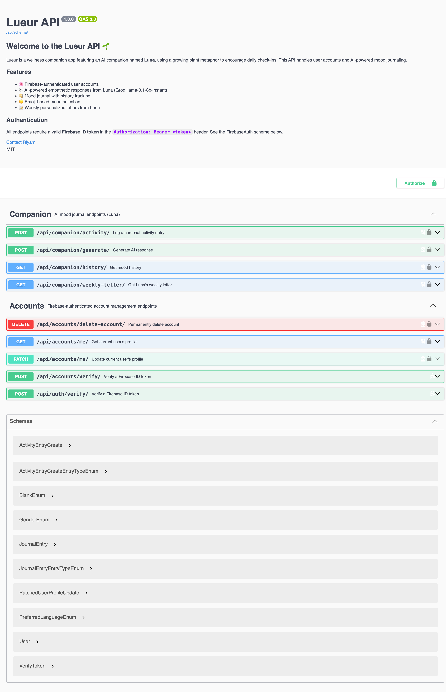
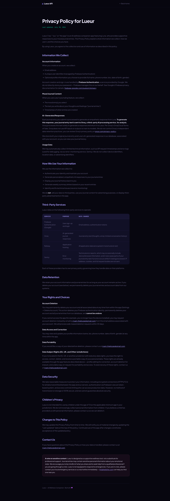

# Lueur Backend — AI Wellness Companion API

A Django REST Framework backend that provides AI-powered emotional support, plus account/profile management. Users share their mood with an emoji and thoughts, and **Luna** (the AI companion) responds with an empathetic, personalised message. All entries are saved per user for history tracking and weekly reflections.

Powered by the **Groq API** — no local GPU or ML dependencies required.

Authentication is handled entirely by **Firebase Auth**: the client (e.g. a Flutter app) signs in via Firebase (email/password, Google, Apple), and Django verifies the resulting Firebase ID token on every request — Django never issues, stores, or refreshes its own credentials.

Every journal entry is checked for crisis language **before** it ever reaches an LLM, in both English and Arabic. See [Crisis Detection](#crisis-detection) below.

Luna speaks **English and Arabic** (Modern Standard Arabic), selected per-user via `preferred_language`, with Arabic replies correctly gender-conjugated based on the user's `gender`. See [Localization](#localization-arabic-support) below.

---

## Features

### Companion (`/api/companion/`)

- **Luna AI responses** — warm, empathetic replies via Groq's fast cloud API, with automatic retry (2 attempts, short backoff) and a graceful fallback message if Groq is unreachable
- **Bilingual, gender-aware responses** — Luna replies in the user's `preferred_language` (English or Arabic), and Arabic replies are steered to address the user with the correct grammatical gender — see [Localization](#localization-arabic-support)
- **Multi-turn conversations** — pass conversation history so Luna maintains context across messages
- **Session detection** — Luna appends `[SESSION_END]` when the user feels resolved; clients use this to close sessions
- **Crisis detection** — journal text is checked for crisis language *before* any AI call, in both English and Arabic, at both the endpoint and the AI-service layer; a match returns a static, localized, gender-correct support response (with real hotline info) and `crisis_flagged: true`, and is redacted before ever appearing in a weekly letter prompt — see [Crisis Detection](#crisis-detection)
- **Mood journal** — every entry (emoji + thoughts + AI reply) is saved per user
- **Multi-type journal entries** — the journal isn't just mood chats: it also logs completed activities — breathing exercises, sudoku, drawing, and weekly letter reads — via `entry_type` and a per-type `payload`, all through the same history/streak machinery
- **Weekly letter** — Luna writes a personal weekly reflection based on recent entries (in the user's preferred language), including a real consecutive-day streak (not just an entry count)
- **Per-user data isolation** — every entry is scoped to the authenticated user (`request.user`); no client-supplied identifier is ever accepted
- **Entry deletion** — delete a single journal entry by id, or every entry at once, both hard-deleted and scoped strictly to the authenticated user; the bulk delete requires an explicit `{"confirm": true}` body and is rate-limited to 5/minute — see [Deleting Journal Entries](#deleting-journal-entries)

### Accounts (`/api/accounts/`)

- **Firebase-backed identity** — registration, login, logout, password reset, email verification, Google/Apple sign-in are all handled by Firebase Auth on the client; Django only verifies the resulting ID token
- **Custom user model** — `accounts.User` (email as `USERNAME_FIELD`), linked to Firebase via a nullable, unique `firebase_uid`, auto-created on first sight of a new Firebase identity
- **Profile management** — view/update profile (`full_name`, `phone_number`, `bio`, `date_of_birth`, `gender`, `preferred_language`); identity-bearing fields (`firebase_uid`, `email`, `username`, staff flags) are never client-writable
- **Language preference** — `preferred_language` (`en`/`ar`, `TextChoices`, defaults to `en`) drives which language Luna responds in, everywhere — chat, weekly letter, crisis response, and fallback messages
- **Account deletion** — deletes the Firebase identity, all of the user's `JournalEntry` rows, then the local Django record; fails closed (nothing deleted) if the Firebase-side call errors. Users who can't open the app can request the same deletion by email — see [Account Deletion](#account-deletion)
- **Consistent response envelope** — every endpoint returns `{"success": bool, "message": str, "data": {...}}` or `{"success": false, "message": str, "errors": {...}}`

### General

- **Interactive API docs** — Swagger UI at `/api/docs/`, ReDoc at `/api/redoc/`
- **Health check** — `GET /health/` (unauthenticated) for Railway and uptime monitoring
- **Production-ready** — Railway deployment with Gunicorn + WhiteNoise

---

## Demo

Deployed on Railway at [web-production-f8628.up.railway.app](https://web-production-f8628.up.railway.app).

The screenshots below are taken from this branch running locally and reflect the current homepage, privacy policy, and API docs — nine clean endpoints, the `JournalEntry` schema (including `entry_type`/`payload`), the request lifecycle, and the production stack, all on one page.

> **Note:** the screenshots themselves predate the two `entries/` delete endpoints added below and haven't been regenerated in this change — the endpoint count in the text above is accurate, but the images won't show the two new DELETE cards until they're refreshed.


---

## Technology Stack

| Layer | Technology |
| --- | --- |
| Framework | Django 5.1.4 + Django REST Framework 3.17.1 |
| AI Model | Groq API — `openai/gpt-oss-20b` (cloud) |
| Auth | Firebase Authentication via `firebase-admin` (server-side ID token verification only) |
| API Docs | drf-spectacular (Swagger UI + ReDoc) |
| Database | SQLite (dev) / PostgreSQL (prod recommended) |
| HTTP Client | Python `requests` |
| Static Files | WhiteNoise |
| Deployment | Gunicorn + Railway |

---

## Authentication Architecture

```text
Flutter client → Firebase Auth → Firebase ID Token → Django API
                                                          │
                                          core.firebase_auth.FirebaseAuthentication
                                                          │
                                                    request.user
                                                          │
                                               Luna business logic
```

- Firebase owns: registration, login, logout, password reset, email verification, Google/Apple sign-in, and the entire token lifecycle (issuance, refresh, revocation).
- Django owns: user profile data, mood history, weekly letters, and admin functionality — and verifies every request's Firebase ID token before any view code runs.
- Every protected endpoint requires `Authorization: Bearer <firebase-id-token>`. Missing, malformed, invalid, or expired tokens return `401 Unauthorized`.
- On first sight of a new `firebase_uid`, Django auto-creates a matching `accounts.User` row — no separate registration call to Django is needed.

---

## Quick Start

### Prerequisites

- Python 3.11+
- A Groq API key — get one free at [console.groq.com](https://console.groq.com)
- A Firebase project with a service-account credentials JSON (for verifying ID tokens) — see [Firebase Console → Project Settings → Service Accounts](https://console.firebase.google.com/)

### Setup

```bash
# 1. Clone and enter the project
git clone <repository-url>
cd lueur-backend

# 2. Create and activate virtual environment
python -m venv venv
source venv/bin/activate  # Windows: venv\Scripts\activate

# 3. Install dependencies
pip install -r requirements.txt

# 4. Set environment variables
export GROQ_API_KEY="your-groq-api-key"
export FIREBASE_CREDENTIALS_PATH="/path/to/firebase-service-account.json"
export SECRET_KEY="your-secret-key"   # optional in dev
export DEBUG="True"                   # optional in dev

# 5. Run migrations
python manage.py migrate

# 6. Start the server
python manage.py runserver
```

Server runs at `http://127.0.0.1:8000/`

> Note: `manage.py check`/`makemigrations`/non-auth tests run fine without `FIREBASE_CREDENTIALS_PATH` set — Firebase initialization is lazy and only required when an authenticated request actually comes in.

---

## API Endpoints

Every endpoint below requires `Authorization: Bearer <firebase-id-token>` **except** `/api/accounts/verify/` (and its `/api/auth/verify/` alias), which is called right after Firebase sign-in — before the client has anything to put in that header — and `GET /health/`, used by Railway/uptime monitoring.

### Companion — Base URL: `/api/companion/`

| Method | Endpoint | Description |
| --- | --- | --- |
| POST | `/api/companion/generate/` | Submit mood, get Luna's AI response (scoped to the authenticated user). Crisis-language input short-circuits before any Groq call. |
| GET | `/api/companion/history/` | Get all saved entries for the authenticated user — a mix of mood chats and logged activities |
| GET | `/api/companion/weekly-letter/` | Get Luna's weekly reflection letter and real streak stats for the authenticated user |
| POST | `/api/companion/activity/` | Log a completed activity (breathing, sudoku, drawing, or letter_read) — no AI call, no crisis check |
| DELETE | `/api/companion/entries/<id>/delete/` | Delete one journal entry owned by the authenticated user. 404 if it doesn't exist or belongs to someone else |
| DELETE | `/api/companion/entries/delete-all/` | Delete every journal entry owned by the authenticated user. Requires `{"confirm": true}`; rate-limited to 5/minute |

### Accounts — Base URL: `/api/accounts/`

| Method | Endpoint | Auth | Description |
| --- | --- | --- | --- |
| GET | `/api/accounts/me/` | Required | Get the authenticated user's profile |
| PATCH | `/api/accounts/me/` | Required | Update editable profile fields (`full_name`, `phone_number`, `bio`, `date_of_birth`, `gender`, `preferred_language`) |
| DELETE | `/api/accounts/delete-account/` | Required | Delete the user's Firebase identity, journal entries, and local account permanently |
| POST | `/api/accounts/verify/` (alias: `/api/auth/verify/`) | None | Verify a Firebase ID token, auto-creating the linked `accounts.User` on first sight |

Registration, login, logout, token refresh, password reset, email verification, and profile-photo upload are **not** Django endpoints — they're handled entirely by Firebase Auth (and Firebase Storage for photos) on the client.

Interactive docs available at:

- **Swagger UI**: `/api/docs/`
- **ReDoc**: `/api/redoc/`

#### Swagger UI



#### ReDoc


#### Privacy Policy

Served at `/privacy/` — required for both the Google Play and App Store listings.



---

### POST `/api/companion/generate/`

Submit a mood entry. Luna responds with an empathetic message that is saved to the journal under the authenticated user.

**Request body**:

```json
{
  "emoji": "😔",
  "thoughts": "Feeling overwhelmed with everything lately",
  "history": [
    {"role": "user", "content": "I feel anxious"},
    {"role": "assistant", "content": "I hear you..."}
  ]
}
```

- **`history`**: optional — list of prior `{"role", "content"}` messages for multi-turn context. Only the last 10 items are used.
- There is no `user_id` field — the entry is always attributed to `request.user`.
- There is no `preferred_language`/`gender` field either — Luna's reply language and grammatical gender come from the authenticated user's profile (`request.user.preferred_language`, `request.user.gender`), never from the request body. See [Localization](#localization-arabic-support).

**Response (200)**:

```json
{
  "id": 1,
  "user_id": "1",
  "emoji": "😔",
  "thoughts": "Feeling overwhelmed with everything lately",
  "ai_response": "It sounds like you're carrying a lot right now...",
  "created_at": "2026-06-22T10:30:00Z",
  "crisis_flagged": false
}
```

When the user feels better or resolved, Luna's `ai_response` will end with `[SESSION_END]` — clients should detect this tag and close the session.

**Error (401)** — missing/invalid/expired token:

```json
{ "detail": "Invalid or expired token." }
```

If the Groq API is unavailable, the entry is still saved with a localized fallback message — English: `"Luna is taking a little break right now. Please try again in a moment 🌿"`, Arabic: `"لونا بحاجة إلى دقيقة الآن. حاول مرة أخرى بعد قليل 🌿"`.

---

### POST `/api/companion/activity/`

Logs a completed activity — no AI call, no crisis check. `entry_type` is one of `breathing`, `sudoku`, `drawing`, `letter_read` (`mood_chat` is `generate/`'s job); `payload` shape is validated per type.

**Request body**:

```json
{ "entry_type": "breathing", "payload": { "duration_seconds": 90 } }
```

```json
{ "entry_type": "sudoku", "payload": { "solved": true, "duration_seconds": 240, "difficulty": "medium" } }
```

**Response (201)**:

```json
{
  "id": 51,
  "user_id": "7",
  "entry_type": "sudoku",
  "payload": { "solved": true, "duration_seconds": 240, "difficulty": "medium" },
  "created_at": "2026-08-25T19:00:00Z"
}
```

---

### Deleting Journal Entries

Both endpoints are hard deletes — there is no soft-delete flag anywhere in this codebase, matching `DeleteAccountView`'s convention. Both are scoped to `request.user`; neither accepts a `user_id` from the client.

**DELETE `/api/companion/entries/<id>/delete/`** — deletes a single entry. The lookup and the ownership check happen in one query (`JournalEntry.objects.filter(user_id=str(request.user.id), pk=entry_id)`), never a plain `pk`-only lookup — so an `id` that exists but belongs to another user returns the same `404` as an `id` that doesn't exist at all, and never leaks which case it was.

```bash
curl -X DELETE https://web-production-f8628.up.railway.app/api/companion/entries/51/delete/ \
  -H "Authorization: Bearer <firebase_id_token>"
```

- **204 No Content** — deleted
- **404** — no matching entry for this user (wrong id, or someone else's entry)
- **401** — missing/invalid/expired token

**DELETE `/api/companion/entries/delete-all/`** — deletes every entry owned by the authenticated user. Requires an explicit confirmation body; without it, nothing is deleted:

```bash
curl -X DELETE https://web-production-f8628.up.railway.app/api/companion/entries/delete-all/ \
  -H "Authorization: Bearer <firebase_id_token>" \
  -H "Content-Type: application/json" \
  -d '{"confirm": true}'
```

```json
{ "deleted_count": 12 }
```

- **200** — `{"deleted_count": N}`, even if `N` is `0`
- **400** — `confirm` missing or `false` — nothing is deleted
- **401** — missing/invalid/expired token
- **429** — throttled past `delete_all`'s `5/minute` scope (`DeleteAllJournalEntriesRateThrottle` in `therapist/throttles.py`, tighter than the global `60/minute` default since this is destructive)

Both views are plain `APIView` subclasses (not `ModelViewSet`/generics), matching the rest of `therapist/views.py`.

---

### Crisis Detection

`thoughts` is checked against **two independent** crisis-language patterns — English (`therapist/crisis.py`) and Arabic (`therapist/crisis_ar.py`) — **before** `generate_ai_response` is ever called, so Groq never sees crisis text. Both detectors run on *every* message regardless of the user's `preferred_language` (someone set to `en` might still type in Arabic, and vice versa); either one matching is enough to trigger the crisis path. This runs at two layers for defense in depth: once in `GenerateResponseAPIView` and again inside `ai_model.generate_ai_response()` itself, in case anything else ever calls it directly.

`therapist/crisis.py` is treated as **frozen** — it is never edited; `crisis_ar.py` is a separate sibling module with its own flat keyword list (200+ MSA phrases covering direct statements, self-harm, indirect/euphemistic expressions, hopelessness, intent, plans, imminence, farewells, and attempts-in-progress), matched the same simple "any substring match = True" way, with no weighting, negation-detection, or third-person/fiction-detection (deliberately deferred — see the module docstring).

A match:

- Skips the Groq call entirely
- Saves the entry with a static support response — in the user's `preferred_language`, and (for Arabic) grammatically conjugated to the user's `gender` — no AI-generated text
- Returns `crisis_flagged: true` in the response
- Logs which language(s) matched (`logger.warning("Crisis language detected (languages=%s) ...")`) for observability

```json
{
  "id": 7,
  "user_id": "1",
  "emoji": "😔",
  "thoughts": "I want to kill myself",
  "ai_response": "It sounds like you're carrying something really heavy right now...\n\n• US: call or text 988 (Suicide & Crisis Lifeline)\n• Outside the US: https://findahelpline.com\n\n...",
  "created_at": "2026-06-22T10:30:00Z",
  "crisis_flagged": true
}
```

The same check also runs when building `weekly-letter/`'s prompt: any past entry that matches is redacted to `"(a difficult moment)"` before its text is sent to Groq, so a flagged entry from earlier in the week can't leak into a third-party API call via the weekly summary.

This is keyword-based pattern matching, not a clinical or diagnostic tool, and it **will** produce false positives on non-literal phrasing (e.g. "I can't go on watching this show"). That tradeoff is intentional — over-triggering toward a support message is safer than under-triggering and saying nothing.

---

### GET `/api/companion/history/`

Returns all mood entries for the authenticated user, newest first.

**Response (200)**:

```json
[
  {
    "id": 2,
    "user_id": "1",
    "emoji": "😊",
    "thoughts": "Had a great day!",
    "ai_response": "That's wonderful to hear...",
    "created_at": "2026-06-22T14:00:00Z"
  }
]
```

---

### GET `/api/companion/weekly-letter/`

Luna writes a personal letter summarising the authenticated user's emotional week (last 7 days).

Requires at least **2 entries** in the past 7 days; returns `null` with a reason otherwise.

`stats.streak` is a real consecutive-day count (`calculate_streak()` in `therapist/views.py`), not just the number of entries — it walks backward from today (or yesterday, if nothing was logged today) and stops at the first gap. Any crisis-flagged entry in the window is redacted before its text is sent to Groq for the letter itself — see [Crisis Detection](#crisis-detection).

The letter is written in the authenticated user's `preferred_language`. Its Groq-response cache key includes `preferred_language` and `gender`, so a cached English letter can never be served to an Arabic-preferring user (or vice versa) — see [Localization](#localization-arabic-support).

**Response (200)**:

```json
{
  "letter": "Dear friend,\n\nThis week you carried both weight and warmth...\n\n— Luna 🌿",
  "stats": {
    "entry_count": 5,
    "dominant_emoji": "😔",
    "streak": 5,
    "week_start": "2026-06-15",
    "week_end": "2026-06-22"
  }
}
```

**Response when not enough entries**:

```json
{
  "letter": null,
  "reason": "not_enough_entries"
}
```

---

### Accounts API Details

Every accounts endpoint returns a consistent envelope (except auth failures, which use DRF's default `{"detail": "..."}` shape since they happen before any view code runs):

```json
{ "success": true, "message": "...", "data": { ... } }
```

or, on failure:

```json
{ "success": false, "message": "...", "errors": { ... } }
```

**GET / PATCH `/api/accounts/me/`** — `GET` returns the authenticated user's profile; `PATCH` updates only `full_name`, `phone_number`, `bio`, `date_of_birth`, `gender`. Any other field in the payload (`firebase_uid`, `email`, `username`, `is_staff`, ...) is silently ignored.

**POST `/api/accounts/verify/`** (alias `/api/auth/verify/`) — No auth required; called by the client right after Firebase sign-in/sign-up. Verifies the Firebase ID token and returns a flat (non-enveloped) JSON object, auto-creating the linked `accounts.User` on first sight:

```json
{
  "firebase_uid": "abc123",
  "email": "user@example.com",
  "name": "Alex",
  "picture": "https://...",
  "email_verified": true,
  "is_new_user": false
}
```

### Account Deletion

**DELETE `/api/accounts/delete-account/`** (self-service, requires auth) — Deletes the Firebase identity (`firebase_admin.auth.delete_user`) first, then all matching `therapist.JournalEntry` rows, then the local Django row. If the Firebase-side call fails, the request returns `502` and nothing else is deleted (no orphaned Firebase identity, retryable).

**Web-based deletion request** (no app access required) — The privacy policy (`/privacy/`) promises a way to request deletion for users who can't open the app. That promise is backed by `accounts.services.delete_user_account()` — the exact same function the API endpoint calls — exposed as a management command:

```bash
python manage.py delete_user_by_email someone@example.com
```

Both paths share one implementation, so there's no risk of the manual path doing something different (or less complete) than the in-app one.

---

## Localization (Arabic Support)

Luna responds in English or Modern Standard Arabic based on the user's `accounts.User.preferred_language` (`en`/`ar`, `TextChoices`, defaults to `en`, updatable via `PATCH /api/accounts/me/`). Arabic replies are also steered to address the user with the correct grammatical gender, from the existing `accounts.User.gender` field (reused rather than adding a second gender field — `other`/`prefer_not_to_say`/blank all resolve to the masculine form, Modern Standard Arabic's grammatical default for an unspecified audience).

All of this is centralized in **`therapist/luna_prompts.py`** — `LunaPromptProvider` is the single place anything Luna-voiced goes through; nothing else in the codebase branches on `preferred_language`/`gender` directly.

There are two different mechanisms, used for two different kinds of content:

- **Model-steering** (chat system prompt, weekly-letter prompt) — these are instructions *to* the LLM, not literal text shown to the user. `LunaPromptProvider` prepends one of `GENDER_INSTRUCTIONS_AR` (a one-line "address the user in the masculine/feminine/neutral form" instruction) ahead of the Arabic prompt, and lets the model conjugate its own generated reply.
- **Literal template substitution** (crisis response) — this is fixed, final text sent verbatim to the user. `apply_gender_variant(template, gender)` does a simple regex substitution of `{male_form/female_form}` markers embedded in the Arabic template — no templating engine, easy to audit at a glance.

| Content | English source | Arabic source | Gender handling |
| --- | --- | --- | --- |
| Chat system prompt | `LUNA_SYSTEM_PROMPT_EN` | `LUNA_SYSTEM_PROMPT_AR` | Model-steering prepend |
| Weekly letter prompt | `WEEKLY_LETTER_PROMPT_EN` | `WEEKLY_LETTER_PROMPT_AR` | Model-steering prepend |
| Groq-error fallback | `GROQ_ERROR_FALLBACK_EN` | `GROQ_ERROR_FALLBACK_AR` | None (no gendered verb in either language's copy) |
| Budget-guard "distracted friend" lines | `groq_budget_guard.BUDGET_EXCEEDED_MESSAGES` | `groq_budget_guard.BUDGET_EXCEEDED_MESSAGES_AR` | None (deliberately gender-neutral phrasing) |
| Crisis response | `therapist.crisis.CRISIS_RESPONSE` (frozen, untouched) | `CRISIS_RESPONSE_AR` | `apply_gender_variant()` |

An unrecognized `preferred_language` value never raises — it silently falls back to English and logs a `logger.warning` + a Sentry breadcrumb (a real value reaching there and not matching `en`/`ar` signals a data-integrity issue upstream, not a normal case).

### Preventing unshipped placeholder text from reaching production

Both Arabic content (`luna_prompts.py`) and the Arabic crisis-detection keyword list (`crisis_ar.py`) went through a placeholder phase during development, guarded so they could never accidentally ship:

```bash
python manage.py check_luna_prompts        # fails if any Arabic prompt is still placeholder text
python manage.py check_crisis_ar_keywords  # fails if the Arabic crisis keyword list is still placeholder text
```

`TherapistConfig.ready()` (`therapist/apps.py`) runs both checks automatically at process startup whenever `DEBUG` is off and it isn't a test run — the app refuses to boot in production if either is still a placeholder. Both checks currently pass with real content in place.

---

## Project Structure

```text
lueur-backend/
├── core/
│   ├── settings.py        # Project settings (env-var driven)
│   ├── urls.py            # Root URL routing (incl. /health/ and the /api/auth/verify/ alias)
│   ├── firebase_auth.py   # FirebaseAuthentication DRF backend + OpenAPI scheme
│   ├── wsgi.py
│   └── asgi.py
├── therapist/
│   ├── models.py          # JournalEntry model (entry_type + payload for non-chat activities)
│   ├── views.py           # GenerateResponseAPIView, AllHistoryAPIView, WeeklyLetterAPIView, ActivityEntryAPIView, calculate_streak()
│   ├── serializers.py     # JournalEntrySerializer, JournalEntryCreateSerializer, ActivityEntryCreateSerializer (no user_id field)
│   ├── ai_model.py        # Groq integration — generate_ai_response(), generate_weekly_letter(), shared _call_groq() retry helper
│   ├── luna_prompts.py    # LunaPromptProvider — language/gender-aware prompts, apply_gender_variant(), placeholder safety checks
│   ├── crisis.py          # contains_crisis_language(), CRISIS_RESPONSE — English crisis detection (frozen, never edited)
│   ├── crisis_ar.py       # contains_crisis_language_ar() — Arabic crisis detection (sibling module, runs alongside crisis.py)
│   ├── groq_budget_guard.py  # Free-tier rate/token budget guard; get_fallback_message() now bilingual
│   ├── apps.py            # TherapistConfig.ready() — production boot check for placeholder Arabic content
│   ├── urls.py            # App URL patterns
│   ├── management/commands/
│   │   ├── check_luna_prompts.py       # Fails if any Arabic Luna prompt is still placeholder text
│   │   └── check_crisis_ar_keywords.py # Fails if the Arabic crisis keyword list is still placeholder text
│   ├── tests.py
│   └── migrations/
├── accounts/
│   ├── models.py          # User (AUTH_USER_MODEL, has firebase_uid, preferred_language, gender)
│   ├── managers.py        # UserManager (email-based create_user/create_superuser)
│   ├── views.py           # MeView, DeleteAccountView, VerifyFirebaseTokenView
│   ├── services.py        # Response envelope helpers + delete_user_account() (shared by the API and the management command)
│   ├── serializers.py     # UserSerializer, UserProfileUpdateSerializer, VerifyTokenSerializer
│   ├── validators.py      # Phone format only
│   ├── management/commands/
│   │   └── delete_user_by_email.py  # Fulfils web-based deletion requests from the privacy policy
│   ├── urls.py            # App URL patterns (me/, delete-account/, verify/)
│   ├── tests.py
│   └── migrations/
├── templates/
│   ├── index.html         # Home page
│   └── privacy.html       # Privacy policy (served at /privacy/)
├── docs/
│   └── screenshots/       # Homepage, privacy policy, Swagger UI, ReDoc screenshots (this README)
├── manage.py
├── requirements.txt
├── Procfile                # Gunicorn config for Railway
└── db.sqlite3               # SQLite database (dev, gitignored)
```

---

## Environment Variables

| Variable | Required | Description |
| --- | --- | --- |
| `GROQ_API_KEY` | **Yes** | Groq API key from [console.groq.com](https://console.groq.com) |
| `FIREBASE_CREDENTIALS_PATH` | **Yes** | Path to a Firebase service-account JSON, used to verify ID tokens |
| `SECRET_KEY` | Recommended | Django secret key (has dev fallback) |
| `DEBUG` | No | `"True"` for dev, `"False"` for prod (default: `False`) |

---

## Deployment

### Railway

1. Connect your GitHub repository on [railway.app](https://railway.app)
2. Add environment variables in the Railway dashboard:
   - `GROQ_API_KEY`, `FIREBASE_CREDENTIALS_PATH`, `SECRET_KEY`, `DEBUG=False`
3. Railway auto-detects the `Procfile` and deploys
4. Run migrations via Railway shell: `python manage.py migrate`

### Heroku

```bash
heroku create your-app-name
heroku config:set GROQ_API_KEY="your-api-key"
heroku config:set FIREBASE_CREDENTIALS_PATH="/app/firebase-service-account.json"
heroku config:set SECRET_KEY="your-secret-key"
heroku config:set DEBUG="False"
git push heroku main
heroku run python manage.py migrate
```

### Production checklist

- [ ] `GROQ_API_KEY` set (**required**)
- [ ] `FIREBASE_CREDENTIALS_PATH` set (**required**)
- [ ] Strong `SECRET_KEY` set
- [ ] `DEBUG=False`
- [x] `ALLOWED_HOSTS` restricted to specific Railway/production domains (no `"*"`)
- [x] CORS headers (`django-cors-headers`) configured for the Flutter client's origin
- [x] `GET /health/` available for uptime monitoring
- [ ] Switch to PostgreSQL
- [ ] Add error logging (Sentry) — referenced in the privacy policy as already in use; confirm `SENTRY_DSN` is actually set in this environment

---

## Admin Dashboard

A staff-only operational dashboard is available at `/admin/` (stock Django Admin — no third-party theme). Staff (`is_staff=True`) accounts can:

- Browse and search `JournalEntry` journal content (filterable by date, entry_type, and crisis-flagged status), including deleting individual rows or a bulk selection via the stock Django Admin delete action — this is separate from the self-service `entries/<id>/delete/` and `entries/delete-all/` API endpoints, which are scoped to a non-staff user's own entries only
- Browse `User` accounts, with a per-user journal-entry count linking to that user's filtered entries
- Run "Delete account and journal entries" on a selected user — a confirmation-gated action that calls the same `delete_user_account()` used by the self-service API and the `delete_user_by_email` management command
- View a live "Overview" summary on the admin index page: active users, journal entries in the last 7/30 days, crisis-flagged entries in the last 7/30 days, and the average check-in streak across users with at least one entry

**Creating a superuser on Railway**: use the Railway CLI's one-off command runner (or the Railway dashboard's equivalent):

```bash
railway run python manage.py createsuperuser
```

No non-staff account can reach `/admin/` — access is gated by Django's standard `is_staff` requirement, not a custom permission layer.

---

## Testing

```bash
python manage.py test           # full suite (120+ tests as of Sep 2026 — check runner output for current count)
python manage.py test therapist # generate/history/weekly-letter/activity, entry deletion (single + bulk), bilingual crisis detection, localization/gender, streak calc
python manage.py test accounts  # profile, preferred_language/gender, delete-account, verify, delete_user_by_email command
```

Tests never hit real external services — mock `generate_ai_response()` / `therapist.ai_model.requests.post` for Groq calls, `core.firebase_auth.auth.verify_id_token` for token verification, and `accounts.services.firebase_auth_admin.delete_user` for Firebase account deletion. The `delete_user_by_email` and account-deletion cascade tests hit the real (test) database directly and assert on actual row counts, not just mock call assertions — this matters because a deletion path is exactly the kind of thing you don't want to trust to "the mock was called":

```python
from unittest.mock import patch
from django.test import TestCase
from rest_framework.test import APIClient

class TherapistAPITests(TestCase):
    def setUp(self):
        self.client = APIClient()
        patcher = patch("core.firebase_auth.auth.verify_id_token")
        self.mock_verify = patcher.start()
        self.addCleanup(patcher.stop)
        self.mock_verify.return_value = {"uid": "test-uid", "email": "t@example.com"}

    @patch('therapist.views.generate_ai_response')
    def test_create_mood_entry(self, mock_generate):
        mock_generate.return_value = "Mocked AI response"
        response = self.client.post(
            '/api/companion/generate/',
            {'emoji': '😊', 'thoughts': 'Great day!'},
            format='json',
            HTTP_AUTHORIZATION="Bearer faketoken",
        )
        self.assertEqual(response.status_code, 200)
        self.assertIn('ai_response', response.data)
```

---

## Integration Examples

### cURL

```bash
# Generate AI response (with optional conversation history)
curl -X POST http://localhost:8000/api/companion/generate/ \
  -H "Content-Type: application/json" \
  -H "Authorization: Bearer <firebase-id-token>" \
  -d '{"emoji": "😊", "thoughts": "Great day!", "history": []}'

# Get history
curl http://localhost:8000/api/companion/history/ \
  -H "Authorization: Bearer <firebase-id-token>"

# Get weekly letter
curl http://localhost:8000/api/companion/weekly-letter/ \
  -H "Authorization: Bearer <firebase-id-token>"

# Get profile
curl http://localhost:8000/api/accounts/me/ \
  -H "Authorization: Bearer <firebase-id-token>"
```

### JavaScript (Fetch)

```javascript
// Obtain a Firebase ID token on the client first, e.g.:
// const idToken = await firebase.auth().currentUser.getIdToken();

// Generate AI response (pass history for multi-turn context)
const res = await fetch('http://localhost:8000/api/companion/generate/', {
  method: 'POST',
  headers: {
    'Content-Type': 'application/json',
    Authorization: `Bearer ${idToken}`,
  },
  body: JSON.stringify({
    emoji: '😊',
    thoughts: 'Feeling good!',
    history: [], // prior [{role, content}] messages
  })
});
const data = await res.json();
// If data.ai_response includes '[SESSION_END]', close the session

// Get history
const history = await fetch('http://localhost:8000/api/companion/history/', {
  headers: { Authorization: `Bearer ${idToken}` },
});
const entries = await history.json();

// Get profile
const meRes = await fetch('http://localhost:8000/api/accounts/me/', {
  headers: { Authorization: `Bearer ${idToken}` },
});
```

---

## Troubleshooting

| Problem | Solution |
| --- | --- |
| 500 on POST `/api/companion/generate/` | Check `GROQ_API_KEY` is set and valid |
| 401 on any endpoint | Missing/invalid/expired Firebase ID token, or `FIREBASE_CREDENTIALS_PATH` not set/invalid — check server logs for "Firebase token verification failed" |
| Static files 404 | Run `python manage.py collectstatic` |
| Database locked | Switch to PostgreSQL for concurrent writes |
| Slow responses | Normal — Groq API takes 1–2 seconds |
| 502 on `DELETE /api/accounts/delete-account/` | Firebase-side deletion failed — the local account is intentionally **not** deleted; retry once the Firebase-side issue is resolved |

---

## Disclaimer

This application provides AI-generated supportive messages and is **not a replacement for professional support**.

If you are in crisis, please reach out:

- **US**: 988 (Suicide & Crisis Lifeline)
- **UK**: 116 123 (Samaritans)
- **International**: [findahelpline.com](https://findahelpline.com)

---

Built with Django REST Framework · Powered by Groq API · Authenticated via Firebase Auth · English & Arabic supported

Last Updated: July 30, 2026
