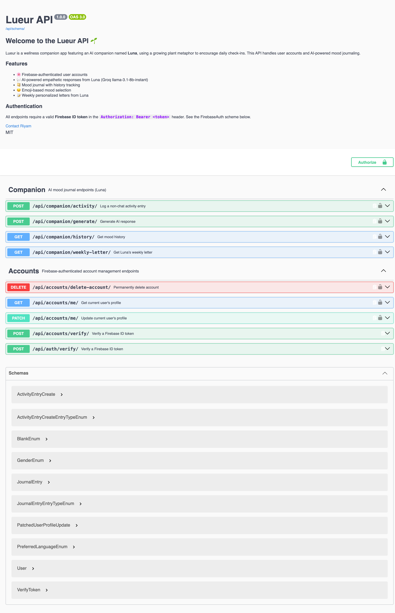

# Lueur Backend — AI Companion API

A Django REST Framework backend that provides AI-powered emotional support, plus account/profile management. Users share their mood with an emoji and thoughts, and **Luna** (the AI companion) responds with an empathetic, personalised message. All entries are saved per user for history tracking and weekly reflections.

Powered by the **Groq API** — no local GPU or ML dependencies required.

Authentication is handled entirely by **Firebase Auth**: the client (e.g. a Flutter app) signs in via Firebase (email/password, Google, Apple), and Django verifies the resulting Firebase ID token on every request — Django never issues, stores, or refreshes its own credentials.

Every journal entry is checked for crisis language **before** it ever reaches an LLM, in both English and Arabic. See [Crisis Detection](#crisis-detection) below.

Luna speaks **English and Arabic** (Modern Standard Arabic), selected per-user via `preferred_language`, with Arabic replies correctly gender-conjugated based on the user's `gender`. See [Localization](#localization-arabic-support) below.

---

## Features

### Companion (`/api/companion/`)

- **Luna AI responses** — warm, casual replies via Groq's fast cloud API, with automatic retry (2 attempts, short backoff). If Luna can't reply (Groq unreachable or the free-tier budget is nearly used up), the client gets an honest "Luna can't reply right now" line flagged `"fallback": true` — and **nothing is saved** to the journal — see [Fallback replies](#fallback-replies)
- **Bilingual, gender-aware responses** — Luna replies in the user's `preferred_language` (English or Arabic), and Arabic replies are steered to address the user with the correct grammatical gender — see [Localization](#localization-arabic-support)
- **Multi-turn conversations** — pass conversation history so Luna maintains context across messages; history is strictly validated (`user`/`assistant` roles and `role`/`content` keys only) and the oldest messages are trimmed automatically past 12,000 characters
- **Session detection** — Luna appends `[SESSION_END]` when the user feels resolved; clients use this to close sessions
- **Crisis detection** — journal text is checked for crisis language *before* any AI call, in both English and Arabic, at both the endpoint and the AI-service layer; a match returns a fixed, localized message in a caring friend's voice (pointing to findahelpline.com and local emergency services) and `crisis_flagged: true`, and is redacted before ever appearing in a weekly letter prompt — see [Crisis Detection](#crisis-detection)
- **Mood journal** — every entry (emoji + thoughts + AI reply) is saved per user
- **Multi-type journal entries** — the journal isn't just mood chats: it also logs completed activities — breathing exercises, sudoku, drawing, and weekly letter reads — via `entry_type` and a per-type `payload`, all through the same history/streak machinery
- **Weekly letter** — Luna writes a short, warm note from a friend about the user's week (in their preferred language) — no mood analysis, nothing heavy brought up — plus a real consecutive-day streak (not just an entry count)
- **Cross-session memory** — when a chat session ends (`[SESSION_END]`), Luna updates a short note (people, plans, things they enjoy or are looking forward to) on a background thread, building on the previous note rather than replacing it, and stores it as a rolling `memory_summary` (≤ 600 characters) on the user's profile (`accounts.User.memory_summary`/`memory_updated_at`); that summary is fed back into the system prompt on future chats so Luna can reference earlier context without the client ever sending or seeing the raw transcript — see [Cross-Session Memory](#cross-session-memory)
- **Context-aware tone** — `generate/` accepts an optional `context_flag` (currently `post_exercise_breathing`) that softens Luna's system prompt right after the user finishes a breathing exercise
- **Per-user data isolation** — every entry is scoped to the authenticated user (`request.user`); no client-supplied identifier is ever accepted
- **Entry deletion** — delete a single journal entry by id, or every entry at once, both hard-deleted and scoped strictly to the authenticated user; the bulk delete requires an explicit `{"confirm": true}` body, also clears Luna's memory of the user and their cached weekly letter, and is rate-limited to 5/minute per user — see [Deleting Journal Entries](#deleting-journal-entries)
- **Content reporting** — flag an offensive, inaccurate, or otherwise problematic Luna response without leaving the app, satisfying Google Play's AI-Generated Content policy requirement for chatbot apps; reports are snapshotted (independent of the original journal entry) and triaged by staff in Django admin — see [Reporting Content](#reporting-content)
- **Groq free-tier budget guard** — `therapist/groq_budget_guard.py` tracks requests/min, requests/day, and tokens/min against Groq's free-tier ceilings (with an 80–90% safety margin) using Django's cache framework; when the shared budget is nearly exhausted, `generate/` skips Groq and returns one of a few rotating, honest "Luna can't reply right now" lines (bilingual, never a human excuse, never a system error, never saved) — see [Fallback replies](#fallback-replies)
- **Luna's voice** — every user-facing string and prompt follows one tone rule, enforced by a test — see [Luna's Voice](#lunas-voice)

### Accounts (`/api/accounts/`)

- **Firebase-backed identity** — registration, login, logout, password reset, email verification, Google/Apple sign-in are all handled by Firebase Auth on the client; Django only verifies the resulting ID token
- **Custom user model** — `accounts.User` (email as `USERNAME_FIELD`), linked to Firebase via a nullable, unique `firebase_uid`, auto-created on first sight of a new Firebase identity
- **Profile management** — view/update profile (`full_name`, `phone_number`, `bio`, `date_of_birth`, `gender`, `preferred_language`); identity-bearing fields (`firebase_uid`, `email`, `username`, staff flags) are never client-writable
- **Language preference** — `preferred_language` (`en`/`ar`, `TextChoices`, defaults to `en`) drives which language Luna responds in, everywhere — chat, weekly letter, crisis response, and fallback messages
- **Account deletion** — deletes the Firebase identity, all of the user's `JournalEntry` rows, then the local Django record; fails closed (nothing deleted) if the Firebase-side call errors, except when the Firebase user is already gone (`UserNotFoundError`), which counts as success so local data is still removed. Users who can't open the app can request the same deletion by email — see [Account Deletion](#account-deletion)
- **Consistent response envelope** — every endpoint returns `{"success": bool, "message": str, "data": {...}}` or `{"success": false, "message": str, "errors": {...}}`

### General

- **Interactive API docs** — Swagger UI at `/api/docs/`, ReDoc at `/api/redoc/`
- **Health check** — `GET /health/` (unauthenticated) for Railway and uptime monitoring
- **Production-ready** — Railway deployment with Gunicorn + WhiteNoise

---

## Demo

Deployed on Railway at [web-production-f8628.up.railway.app](https://web-production-f8628.up.railway.app).

The screenshots below are taken from this branch running locally and reflect the current homepage and API docs — ten clean endpoints, the `JournalEntry` schema (including `entry_type`/`payload`), the request lifecycle, and the production stack, all on one page.

> **Note:** the screenshots themselves predate the `entries/` delete endpoints and the `report/` endpoint added below and haven't been regenerated in this change — the endpoint count in the text above is accurate, but the images won't show those newer cards until they're refreshed.


---

## Technology Stack

| Layer | Technology |
| --- | --- |
| Framework | Django 5.1.4 + Django REST Framework 3.17.1 |
| AI Model | Groq API — `openai/gpt-oss-20b` (cloud) |
| Auth | Firebase Authentication via `firebase-admin` (server-side ID token verification only) |
| API Docs | drf-spectacular (Swagger UI + ReDoc) |
| Admin Theme | `django-jazzmin` (Bootswatch "united" theme, custom icons/CSS) |
| Database | SQLite (dev) / PostgreSQL (prod) — via `dj-database-url` + `psycopg2-binary`, used automatically whenever Railway's `DATABASE_URL` is set |
| CORS | `django-cors-headers` |
| Error Monitoring | `sentry-sdk` (PII-redacting `before_send` hook) |
| HTTP Client | Python `requests` |
| Static Files | WhiteNoise |
| Deployment | Gunicorn + Railway |

---

## Authentication Architecture

```text
Flutter client → Firebase Auth → Firebase ID Token → Django API
                                                          │
                                          core.firebase_auth.FirebaseAuthentication
                                                          │
                                                    request.user
                                                          │
                                               Luna business logic
```

- Firebase owns: registration, login, logout, password reset, email verification, Google/Apple sign-in, and the entire token lifecycle (issuance, refresh, revocation).
- Django owns: user profile data, mood history, weekly letters, and admin functionality — and verifies every request's Firebase ID token before any view code runs.
- Every protected endpoint requires `Authorization: Bearer <firebase-id-token>`. Missing, malformed, invalid, or expired tokens return `401 Unauthorized`.
- On first sight of a new `firebase_uid`, Django auto-creates a matching `accounts.User` row — no separate registration call to Django is needed.

---

## Quick Start

### Prerequisites

- Python 3.11+
- A Groq API key — get one free at [console.groq.com](https://console.groq.com)
- A Firebase project with a service-account credentials JSON (for verifying ID tokens) — see [Firebase Console → Project Settings → Service Accounts](https://console.firebase.google.com/)

### Setup

```bash
# 1. Clone and enter the project
git clone <repository-url>
cd lueur-backend

# 2. Create and activate virtual environment
python -m venv venv
source venv/bin/activate  # Windows: venv\Scripts\activate

# 3. Install dependencies
pip install -r requirements.txt

# 4. Set environment variables
export GROQ_API_KEY="your-groq-api-key"
export FIREBASE_CREDENTIALS_PATH="/path/to/firebase-service-account.json"
export SECRET_KEY="your-secret-key"   # optional in dev
export DEBUG="True"                   # optional in dev

# 5. Run migrations
python manage.py migrate

# 6. Start the server
python manage.py runserver
```

Server runs at `http://127.0.0.1:8000/`

> Note: `manage.py check`/`makemigrations`/non-auth tests run fine without `FIREBASE_CREDENTIALS_PATH` set — Firebase initialization is lazy and only required when an authenticated request actually comes in.

---

## API Endpoints

Every endpoint below requires `Authorization: Bearer <firebase-id-token>` **except** `/api/v1/accounts/verify/` (and its `/api/v1/auth/verify/` alias), which is called right after Firebase sign-in — before the client has anything to put in that header — and `GET /health/`, used by Railway/uptime monitoring.

### API Versioning

`/api/v1/` is the current, recommended path prefix for every endpoint below. The unprefixed `/api/...` routes (e.g. `/api/companion/generate/`) still work — they point at the exact same views — and are kept temporarily for backward compatibility with app versions that haven't updated to `/api/v1/` yet. New clients should use `/api/v1/`; the unprefixed routes will be removed once all deployed app versions have migrated.

### Companion — Base URL: `/api/v1/companion/`

| Method | Endpoint | Description |
| --- | --- | --- |
| POST | `/api/v1/companion/generate/` | Submit mood, get Luna's AI response (scoped to the authenticated user). Crisis-language input short-circuits before any Groq call. |
| GET | `/api/v1/companion/history/` | Get all saved entries for the authenticated user — a mix of mood chats and logged activities |
| GET | `/api/v1/companion/weekly-letter/` | Get Luna's weekly reflection letter and real streak stats for the authenticated user |
| POST | `/api/v1/companion/activity/` | Log a completed activity (breathing, sudoku, drawing, or letter_read) — no AI call, no crisis check |
| DELETE | `/api/v1/companion/entries/<id>/delete/` | Delete one journal entry owned by the authenticated user. 404 if it doesn't exist or belongs to someone else |
| DELETE | `/api/v1/companion/entries/delete-all/` | Delete every journal entry owned by the authenticated user. Requires `{"confirm": true}`; rate-limited to 5/minute |
| POST | `/api/v1/companion/report/` | Report an offensive/inaccurate/uncomfortable Luna response for moderation review |

### Accounts — Base URL: `/api/v1/accounts/`

| Method | Endpoint | Auth | Description |
| --- | --- | --- | --- |
| GET | `/api/v1/accounts/me/` | Required | Get the authenticated user's profile |
| PATCH | `/api/v1/accounts/me/` | Required | Update editable profile fields (`full_name`, `phone_number`, `bio`, `date_of_birth`, `gender`, `preferred_language`) |
| DELETE | `/api/v1/accounts/delete-account/` | Required | Delete the user's Firebase identity, journal entries, and local account permanently |
| POST | `/api/v1/accounts/verify/` (alias: `/api/v1/auth/verify/`) | None | Verify a Firebase ID token, auto-creating the linked `accounts.User` on first sight |

Registration, login, logout, token refresh, password reset, email verification, and profile-photo upload are **not** Django endpoints — they're handled entirely by Firebase Auth (and Firebase Storage for photos) on the client.

Interactive docs available at:

- **Swagger UI**: `/api/docs/`
- **ReDoc**: `/api/redoc/`

#### Swagger UI



#### ReDoc


#### Privacy Policy

`/privacy/` permanently redirects (301) to the canonical policy at [riyam224.github.io/lueur/privacy/](https://riyam224.github.io/lueur/privacy/), which is the single source of truth linked from the Google Play and App Store listings. This backend route exists only so old/bookmarked links keep resolving correctly.

---

### POST `/api/companion/generate/`

Submit a mood entry. Luna responds with an empathetic message that is saved to the journal under the authenticated user.

**Request body**:

```json
{
  "emoji": "😔",
  "thoughts": "Feeling overwhelmed with everything lately",
  "history": [
    {"role": "user", "content": "I feel anxious"},
    {"role": "assistant", "content": "I hear you..."}
  ]
}
```

- **`history`**: optional — list of prior `{"role", "content"}` messages for multi-turn context. Only the last 10 items are used. Validation:
  - `role` must be `user` or `assistant` (a client-supplied `system` turn would override Luna's prompt) and each item may contain **only** `role` and `content` — anything else is a `400`
  - at most 20 items — otherwise `400`
  - any single `content` longer than **5,000** characters is cut to its first 5,000 characters — no error
  - if the total `content` length exceeds **12,000** characters, the **oldest** messages are dropped until it fits — no error, the request still returns `200`
- **`context_flag`**: optional — currently only `post_exercise_breathing` is accepted; it tells Luna's system prompt the user just finished a breathing exercise, so her reply is softer/calmer than a cold-open chat message.
- There is no `user_id` field — the entry is always attributed to `request.user`.
- There is no `preferred_language`/`gender` field either — Luna's reply language and grammatical gender come from the authenticated user's profile (`request.user.preferred_language`, `request.user.gender`), never from the request body. See [Localization](#localization-arabic-support).
- Luna's system prompt also silently incorporates the user's stored `memory_summary` (if any) for continuity across sessions — see [Cross-Session Memory](#cross-session-memory).

**Response (200)**:

```json
{
  "id": 1,
  "user_id": "1",
  "emoji": "😔",
  "thoughts": "Feeling overwhelmed with everything lately",
  "ai_response": "It sounds like you're carrying a lot right now...",
  "created_at": "2026-06-22T10:30:00Z",
  "crisis_flagged": false
}
```

When the user feels better or resolved, Luna's `ai_response` will end with `[SESSION_END]` — clients should detect this tag and close the session.

**Error (401)** — missing/invalid/expired token:

```json
{ "detail": "Invalid or expired token." }
```

#### Fallback replies

If Luna can't reply — Groq is unreachable/errors, or the [budget guard](#features) has no room left (`generate_ai_response()` raises `LunaUnavailable`) — **nothing is written to the journal** and the memory update isn't triggered. The response is still `200` with the same fields as a normal entry, so existing clients keep parsing it, plus `"fallback": true`:

```json
{
  "id": 0,
  "user_id": "1",
  "entry_type": "mood_chat",
  "emoji": "😔",
  "thoughts": "Feeling overwhelmed with everything lately",
  "ai_response": "Luna can't reply right now, give me a minute and try again? 🌿",
  "payload": {},
  "created_at": "2026-10-01T10:30:00Z",
  "crisis_flagged": false,
  "fallback": true
}
```

- `id` is always `0` for a fallback (there's no saved row) — clients should not try to delete or re-fetch it, and should let the user resend their message.
- The text is an honest, warm line in the user's `preferred_language` — never a human excuse ("dropped my phone") and never a system error. Normal replies don't include the `fallback` key at all.

**Rate limiting**: `generate/` carries two independent throttle scopes on top of the global `60/minute` default — `ai_generate` (`ScopedRateThrottle`, `20/minute`) and `luna_chat` (`LunaChatRateThrottle`, a per-user `UserRateThrottle`, `20/min`). Either one tripping returns `429`. This protects the shared Groq free-tier budget from a single user's burst independently of overall endpoint traffic; see also the budget-guard fallback described above under [Features](#features).

---

### POST `/api/companion/activity/`

Logs a completed activity — no AI call, no crisis check. `entry_type` is one of `breathing`, `sudoku`, `drawing`, `letter_read` (`mood_chat` is `generate/`'s job); `payload` shape is validated per type.

**Request body**:

```json
{ "entry_type": "breathing", "payload": { "duration_seconds": 90 } }
```

```json
{ "entry_type": "sudoku", "payload": { "solved": true, "duration_seconds": 240, "difficulty": "medium" } }
```

**Response (201)**:

```json
{
  "id": 51,
  "user_id": "7",
  "entry_type": "sudoku",
  "payload": { "solved": true, "duration_seconds": 240, "difficulty": "medium" },
  "created_at": "2026-08-25T19:00:00Z"
}
```

---

### Deleting Journal Entries

Both endpoints are hard deletes — there is no soft-delete flag anywhere in this codebase, matching `DeleteAccountView`'s convention. Both are scoped to `request.user`; neither accepts a `user_id` from the client.

**DELETE `/api/companion/entries/<id>/delete/`** — deletes a single entry. The lookup and the ownership check happen in one query (`JournalEntry.objects.filter(user_id=str(request.user.id), pk=entry_id)`), never a plain `pk`-only lookup — so an `id` that exists but belongs to another user returns the same `404` as an `id` that doesn't exist at all, and never leaks which case it was.

```bash
curl -X DELETE https://web-production-f8628.up.railway.app/api/v1/companion/entries/51/delete/ \
  -H "Authorization: Bearer <firebase_id_token>"
```

- **204 No Content** — deleted
- **404** — no matching entry for this user (wrong id, or someone else's entry)
- **401** — missing/invalid/expired token

**DELETE `/api/companion/entries/delete-all/`** — deletes every entry owned by the authenticated user, and also wipes what Luna remembers about them: `memory_summary` is cleared, `memory_updated_at` is reset to `null`, and their cached weekly letter is removed (the cache key is rebuilt from the current entries *before* they're deleted). Other users' data is never touched. Requires an explicit confirmation body; without it, nothing is deleted:

```bash
curl -X DELETE https://web-production-f8628.up.railway.app/api/v1/companion/entries/delete-all/ \
  -H "Authorization: Bearer <firebase_id_token>" \
  -H "Content-Type: application/json" \
  -d '{"confirm": true}'
```

```json
{ "deleted_count": 12 }
```

- **200** — `{"deleted_count": N}`, even if `N` is `0`
- **400** — `confirm` missing or `false` — nothing is deleted
- **401** — missing/invalid/expired token
- **429** — throttled past `delete_all`'s `5/minute` per-user limit (`DeleteAllJournalEntriesRateThrottle` in `therapist/throttles.py`, tighter than the global `60/minute` default since this is destructive). It's the view's only throttle class — an earlier version also added `ScopedRateThrottle` with the same scope, which shared the cache key and counted every request twice (effectively ~2/minute)

Both views are plain `APIView` subclasses (not `ModelViewSet`/generics), matching the rest of `therapist/views.py`.

---

### Reporting Content

**POST `/api/companion/report/`** — flags a Luna response for moderation review, satisfying Google Play's AI-Generated Content policy requirement that chatbot apps let users report problematic model output in-app.

```json
{
  "reported_text": "the Luna response being reported",
  "user_message": "the user message that led to it",
  "reason": "offensive_harmful",
  "comment": "optional free-text from the user"
}
```

- **`reported_text`** — required; a snapshot of Luna's reply, stored standalone so the report remains a valid moderation record even if the original `JournalEntry` is later edited or deleted.
- **`user_message`** — optional; a snapshot of the user's message for context.
- **`reason`** — required; one of `offensive_harmful`, `inaccurate`, `uncomfortable`, `other`.
- **`comment`** — optional free text.
- `user` is always `request.user`; `status` always starts at `new` — neither is client-writable.

**Response (201)**:

```json
{ "detail": "Report submitted." }
```

- **400** — missing `reported_text`/`reason`, or `reason` not one of the four valid choices
- **401** — missing/invalid/expired token

Reports are triaged in Django admin (`ContentReport`) — staff can filter by `reason`/`status` and update `status` (`new`/`reviewed`/`dismissed`) inline from the list view. `reported_text`, `user_message`, and `comment` are all redacted from Sentry crash reports via `core.settings._SENTRY_REDACT_FIELDS`, the same mechanism that already protects `thoughts`/`ai_reply`/`memory_summary`.

**Retention on account deletion**: `ContentReport.user` is a real `ForeignKey(..., on_delete=CASCADE)` — unlike `JournalEntry`, which is linked to a user only via a loose `user_id` string and is deleted by an explicit query in `delete_user_account()`. A user's `ContentReport` rows are removed automatically by Django's ORM-level cascade the moment `user.delete()` runs in that same function, with no extra code needed. See [Account Deletion](#account-deletion).

---

### Crisis Detection

`thoughts` is checked against **two independent** crisis-language patterns — English (`therapist/crisis.py`) and Arabic (`therapist/crisis_ar.py`) — **before** `generate_ai_response` is ever called, so Groq never sees crisis text. Both detectors run on *every* message regardless of the user's `preferred_language` (someone set to `en` might still type in Arabic, and vice versa); either one matching is enough to trigger the crisis path. This runs at two layers for defense in depth: once in `GenerateResponseAPIView` and again inside `ai_model.generate_ai_response()` itself, in case anything else ever calls it directly.

Both modules are plain keyword matching — no NLP, no weighting — and both lean toward flagging: a false alarm is better than a missed crisis message.

- **English (`crisis.py`)** catches direct phrases plus common slang and inflections (`suicidal`, `killing myself`, `wanna die`, `unalive`, `I don't want to be here`, and `kms` as a whole word). Curly apostrophes and extra spaces are normalized first. Only two narrow exceptions exist — `don't/dont/do not want to die` and `Suicide Squad` — and they're blanked out rather than short-circuiting, so a real crisis phrase elsewhere in the same message is still caught.
- **Arabic (`crisis_ar.py`)** has its own flat keyword list (direct statements, self-harm, indirect expressions, hopelessness, intent, plans, imminence, farewells, attempts-in-progress, and dialect forms like `بدي انتحر`/`ابي اموت`/`اقتل حالي`). Both the text and the keywords are normalized before matching: diacritics and tatweel stripped, `أ/إ/آ/ٱ → ا`, `ى → ي`, `ة → ه`, `ؤ → و`, `ئ → ي` — so hamza-less spellings like `اريد انتحر` match. Generic phrases that flagged everyday messages (`بعد قليل`, `أنا جاد`, `لدي خطة`, `اعتنوا بأنفسكم`, `لا يوجد حل`, `هذا هو الوقت`) were removed. There is still no negation or third-person detection (see the module docstring).

A match:

- Skips the Groq call entirely
- Saves the entry with a fixed message in Luna's caring-friend voice — in the user's `preferred_language` (Arabic uses one gender-neutral text for everyone) — pointing to findahelpline.com and the local emergency number; no AI-generated text
- Returns `crisis_flagged: true` in the response
- Logs which language(s) matched (`logger.warning("Crisis language detected (languages=%s) ...")`) for observability

```json
{
  "id": 7,
  "user_id": "1",
  "emoji": "😔",
  "thoughts": "I want to kill myself",
  "ai_response": "Hey, I'm really glad you told me. This is a lot to hold on your own...\n\n• US: call or text 988 (Suicide & Crisis Lifeline)\n• Anywhere else: https://findahelpline.com\n\n...",
  "created_at": "2026-06-22T10:30:00Z",
  "crisis_flagged": true
}
```

The same check also runs when building `weekly-letter/`'s prompt: any past entry that matches is redacted to `"(a difficult moment)"` before its text is sent to Groq, so a flagged entry from earlier in the week can't leak into a third-party API call via the weekly summary.

This is keyword-based pattern matching, not a clinical or diagnostic tool, and it **will** produce false positives on non-literal phrasing (e.g. "I can't go on watching this show", or `kms` meaning kilometres). That tradeoff is intentional — over-triggering toward a support message is safer than under-triggering and saying nothing.

---

### Cross-Session Memory

When a chat exchange's `ai_response` ends with `[SESSION_END]` (Luna judged the user resolved/at a natural stopping point), `GenerateResponseAPIView` calls `trigger_memory_update()` (`therapist/ai_model.py`), which spawns a **daemon background thread** so the summarization work never delays the HTTP response already sent to the client.

That thread:

1. Rebuilds the full session transcript (`history` + the current turn), redacting any crisis-flagged message to `"(a difficult moment)"` the same way the weekly letter does
2. Reads the user's current `memory_summary` fresh from the database and sends it, together with the transcript, to Groq with `LunaPromptProvider.get_memory_summary_prompt()` (localized/gendered like everything else Luna-voiced). The prompt asks for a friend's note — people in their life, plans and things coming up, what they enjoy, what they're excited or worried about — that **updates** the earlier note (keep what still matters, drop what doesn't) in 2–4 sentences
3. Stores the result in `accounts.User.memory_summary` (hard-capped at 600 characters, cut at a sentence end — `MEMORY_SUMMARY_MAX_CHARS`) and stamps `memory_updated_at` — one rolling note per user, not a growing log

That stored `memory_summary` is then passed into `generate_ai_response()` as context on the user's *next* chat, so Luna's system prompt can reference earlier context ("last time you mentioned...") without the client ever needing to resend history across sessions.

Notes:

- This is best-effort: if the Groq call fails, if the budget guard rejects it, or if Groq returns an empty summary, `memory_summary` is simply left unchanged for that turn — no error surfaces to the user.
- The transcript passed to Groq is never persisted anywhere beyond the summarization call itself — only the resulting summary text is stored.
- `memory_summary` is deleted along with the rest of the user's data on account deletion (see [Account Deletion](#account-deletion)), and is also cleared (with `memory_updated_at` reset) by `DELETE entries/delete-all/`.
- Sentry's payload scrubber (`core/settings.py` `_SENTRY_REDACT_FIELDS`) explicitly redacts `memory_summary` alongside `thoughts`/`content`/`ai_reply`/`transcript`, so it can never leak into an error report.

---

### GET `/api/companion/history/`

Returns all mood entries for the authenticated user, newest first.

**Response (200)**:

```json
[
  {
    "id": 2,
    "user_id": "1",
    "emoji": "😊",
    "thoughts": "Had a great day!",
    "ai_response": "That's wonderful to hear...",
    "created_at": "2026-06-22T14:00:00Z"
  }
]
```

---

### GET `/api/companion/weekly-letter/`

Luna writes a short, warm note from a friend about the authenticated user's week (last 7 days): a couple of specific things they shared — people, plans, small wins, things they enjoyed — and some encouragement for the week ahead. It's deliberately not a "week in review": no mood counts or analysis, and if they shared something heavy it isn't brought up.

Requires at least **2 entries** in the past 7 days; returns `null` with a reason otherwise.

`stats.streak` is a real consecutive-day count (`calculate_streak()` in `therapist/views.py`), not just the number of entries — it walks backward from today (or yesterday, if nothing was logged today) and stops at the first gap. Any crisis-flagged entry in the window is redacted before its text is sent to Groq for the letter itself — see [Crisis Detection](#crisis-detection).

The letter is written in the authenticated user's `preferred_language`. Its Groq-response cache key includes `preferred_language` and `gender`, so a cached English letter can never be served to an Arabic-preferring user (or vice versa) — see [Localization](#localization-arabic-support).

**Response (200)**:

```json
{
  "letter": "Hey friend,\n\nSounds like that dinner with Sara was just what you needed...\n\n— Luna 🌿",
  "stats": {
    "entry_count": 5,
    "dominant_emoji": "😔",
    "streak": 5,
    "week_start": "2026-06-15",
    "week_end": "2026-06-22"
  }
}
```

**Response when not enough entries** (fewer than 2 entries in the last 7 days — `stats` is omitted entirely):

```json
{
  "letter": null,
  "reason": "not_enough_entries"
}
```

**Response when Groq fails** (enough entries existed, but `generate_weekly_letter()` raised — e.g. Groq is unreachable): `letter` is `null` but `stats` is still populated, and there is **no `reason` key** — this is how an integrator distinguishes it from the not-enough-entries case above.

```json
{
  "letter": null,
  "stats": {
    "entry_count": 5,
    "dominant_emoji": "😔",
    "streak": 5,
    "week_start": "2026-06-15",
    "week_end": "2026-06-22"
  }
}
```

---

### Accounts API Details

Every accounts endpoint returns a consistent envelope (except auth failures, which use DRF's default `{"detail": "..."}` shape since they happen before any view code runs):

```json
{ "success": true, "message": "...", "data": { ... } }
```

or, on failure:

```json
{ "success": false, "message": "...", "errors": { ... } }
```

**GET / PATCH `/api/accounts/me/`** — `GET` returns the authenticated user's profile; `PATCH` updates only `full_name`, `phone_number`, `bio`, `date_of_birth`, `gender`. Any other field in the payload (`firebase_uid`, `email`, `username`, `is_staff`, ...) is silently ignored.

**POST `/api/accounts/verify/`** (alias `/api/auth/verify/`) — No auth required; called by the client right after Firebase sign-in/sign-up. Verifies the Firebase ID token and returns a flat (non-enveloped) JSON object, auto-creating the linked `accounts.User` on first sight:

```json
{
  "firebase_uid": "abc123",
  "email": "user@example.com",
  "name": "Alex",
  "picture": "https://...",
  "email_verified": true,
  "is_new_user": false
}
```

### Account Deletion

**DELETE `/api/accounts/delete-account/`** (self-service, requires auth) — Deletes the Firebase identity (`firebase_admin.auth.delete_user`) first, then all matching `therapist.JournalEntry` rows, then the local Django row (`user.delete()`). If the Firebase-side call fails, the request returns `502` with `"We couldn't delete your account just now, and nothing was removed. Please try again in a bit."` and nothing else is deleted (no orphaned Firebase identity, retryable). The one exception is Firebase's `UserNotFoundError`: the identity is already gone, which is the outcome we want, so it's logged as a warning and the local data is deleted anyway. This applies to all three deletion paths (API, admin action, `delete_user_by_email`), since they share `delete_user_account()`. That final `user.delete()` also cascades to the user's `therapist.ContentReport` rows via a real `ForeignKey(on_delete=CASCADE)` — no separate query needed, unlike `JournalEntry` above — so submitted content reports don't outlive the account that filed them.

**Web-based deletion request** (no app access required) — The privacy policy (`/privacy/`) promises a way to request deletion for users who can't open the app. That promise is backed by `accounts.services.delete_user_account()` — the exact same function the API endpoint calls — exposed as a management command:

```bash
python manage.py delete_user_by_email someone@example.com
```

Both paths share one implementation, so there's no risk of the manual path doing something different (or less complete) than the in-app one.

**Weekly letter cache warm-up** — `therapist/management/commands/generate_weekly_letters.py` pre-generates Luna's weekly letter (via `therapist/services.py::warm_weekly_letter_cache()`) for every user with at least 2 entries in the last 7 days, populating `generate_weekly_letter()`'s 24-hour cache ahead of time:

```bash
python manage.py generate_weekly_letters
```

Intended to run nightly via Railway Cron, so that when a user actually opens `GET /api/companion/weekly-letter/` during the day, it serves from cache instead of making a live Groq call. It shares `build_weekly_letter_context()` with the live endpoint, so the warmed cache entry is generated from the exact same data the endpoint would otherwise compute itself.

---

## Localization (Arabic Support)

Luna responds in English or Modern Standard Arabic based on the user's `accounts.User.preferred_language` (`en`/`ar`, `TextChoices`, defaults to `en`, updatable via `PATCH /api/accounts/me/`). Arabic replies are also steered to address the user with the correct grammatical gender, from the existing `accounts.User.gender` field (reused rather than adding a second gender field — `other`/`prefer_not_to_say`/blank all resolve to the masculine form, Modern Standard Arabic's grammatical default for an unspecified audience).

All of this is centralized in **`therapist/luna_prompts.py`** — `LunaPromptProvider` is the single place anything Luna-voiced goes through; nothing else in the codebase branches on `preferred_language`/`gender` directly.

There are two different mechanisms, used for two different kinds of content:

- **Model-steering** (chat system prompt, weekly-letter prompt) — these are instructions *to* the LLM, not literal text shown to the user. `LunaPromptProvider` prepends one of `GENDER_INSTRUCTIONS_AR` (a one-line "address the user in the masculine/feminine/neutral form" instruction) ahead of the Arabic prompt, and lets the model conjugate its own generated reply.
- **Literal template substitution** — fixed, final text sent verbatim to the user. `apply_gender_variant(template, gender)` does a simple regex substitution of `{male_form/female_form}` markers — no templating engine, easy to audit at a glance. The Arabic crisis message currently uses one gender-neutral text with no markers (the app has no reliable gender signal), so this is a no-op for it today.

| Content | English source | Arabic source | Gender handling |
| --- | --- | --- | --- |
| Chat system prompt | `LUNA_SYSTEM_PROMPT_EN` | `LUNA_SYSTEM_PROMPT_AR` | Model-steering prepend |
| Weekly letter prompt | `WEEKLY_LETTER_PROMPT_EN` | `WEEKLY_LETTER_PROMPT_AR` | Model-steering prepend |
| Memory-summary prompt | `MEMORY_SUMMARY_PROMPT_EN` (+ `PREVIOUS_MEMORY_EN`) | `MEMORY_SUMMARY_PROMPT_AR` (+ `PREVIOUS_MEMORY_AR`) | Model-steering prepend |
| Groq-error fallback | `GROQ_ERROR_FALLBACK_EN` | `GROQ_ERROR_FALLBACK_AR` | None (gender-neutral phrasing) |
| Budget-guard "Luna can't reply right now" lines | `groq_budget_guard.BUDGET_EXCEEDED_MESSAGES` | `groq_budget_guard.BUDGET_EXCEEDED_MESSAGES_AR` | None (gender-neutral phrasing) |
| Crisis response | `therapist.crisis.CRISIS_RESPONSE` | `CRISIS_RESPONSE_AR` | None (one gender-neutral text) |

An unrecognized `preferred_language` value never raises — it silently falls back to English and logs a `logger.warning` + a Sentry breadcrumb (a real value reaching there and not matching `en`/`ar` signals a data-integrity issue upstream, not a normal case).

### Luna's Voice

Everything a user can read — chat replies, the memory note, the weekly letter, fallback lines, crisis messages, and error texts — follows one tone rule, in English and Arabic: Luna is a friendly companion, like a close mate. Short, warm, casual sentences; never clinical, therapeutic, or medical. Crisis messages still include real help (findahelpline.com and the local emergency number), written in the same caring friend's voice.

- **Honest about being an AI**: Luna doesn't bring it up herself, but if someone sincerely asks whether they're talking to a person or an AI, she answers honestly and warmly. The chat prompts' "ENDING THE SESSION" heading is now "ENDING THE CHAT"; the `[SESSION_END]` tag itself is unchanged.
- **Fallbacks are honest**: "Luna can't reply right now, give me a minute and try again? 🌿" — never a human excuse ("got distracted", "dropped my phone", "irl") and never a system error.
- **Enforced by a test**: `ToneRuleTests` in `therapist/tests.py` scans every user-facing string and Luna-voiced prompt and fails on banned words — EN: therapy/therapist/therapeutic, treatment, symptom, disorder, diagnosis, mental health, coping, patient, session, support services, clinical, medical, counsel(ing); AR: علاج, معالج, أعراض, اضطراب, تشخيص, الصحة النفسية, التأقلم, مريض, جلسة, خدمات الدعم, طبي. The chat prompts' `NEVER:` / `ممنوع نهائياً:` blocks are stripped before scanning (they must keep naming what's forbidden), as are a few opening negations ("not counseling a client") and the `[SESSION_END]` tag.

### Preventing unshipped placeholder text from reaching production

Both Arabic content (`luna_prompts.py`) and the Arabic crisis-detection keyword list (`crisis_ar.py`) went through a placeholder phase during development, guarded so they could never accidentally ship:

```bash
python manage.py check_luna_prompts        # fails if any Arabic prompt is still placeholder text
python manage.py check_crisis_ar_keywords  # fails if the Arabic crisis keyword list is still placeholder text
```

`TherapistConfig.ready()` (`therapist/apps.py`) runs both checks automatically at process startup whenever `DEBUG` is off and it isn't a test run — the app refuses to boot in production if either is still a placeholder. Both checks currently pass with real content in place.

---

## Project Structure

```text
lueur-backend/
├── core/
│   ├── settings.py        # Project settings (env-var driven)
│   ├── urls.py            # Root URL routing (incl. /health/ and the /api/auth/verify/ alias)
│   ├── firebase_auth.py   # FirebaseAuthentication DRF backend + OpenAPI scheme
│   ├── wsgi.py
│   └── asgi.py
├── therapist/
│   ├── models.py          # JournalEntry (entry_type + payload for non-chat activities), ContentReport (moderation reports)
│   ├── views.py           # GenerateResponseAPIView, AllHistoryAPIView, WeeklyLetterAPIView, ActivityEntryAPIView, ReportContentView, calculate_streak()
│   ├── serializers.py     # JournalEntrySerializer, JournalEntryCreateSerializer, ActivityEntryCreateSerializer, ContentReportSerializer (no user_id field)
│   ├── ai_model.py        # Groq integration — generate_ai_response() (raises LunaUnavailable on a budget miss), generate_weekly_letter(), cumulative memory update, shared _call_groq() retry helper
│   ├── services.py        # build_weekly_letter_context(), warm_weekly_letter_cache(), clear_weekly_letter_cache() — shared by the weekly-letter/delete-all views and generate_weekly_letters
│   ├── luna_prompts.py    # LunaPromptProvider — language/gender-aware prompts, apply_gender_variant(), placeholder safety checks
│   ├── crisis.py          # contains_crisis_language(), CRISIS_RESPONSE — English crisis detection (slang + narrow safe phrases)
│   ├── crisis_ar.py       # contains_crisis_language_ar(), normalize_ar() — Arabic crisis detection (sibling module, runs alongside crisis.py)
│   ├── groq_budget_guard.py  # Free-tier rate/token budget guard; get_fallback_message() returns an honest bilingual "can't reply right now" line
│   ├── throttles.py       # LunaChatRateThrottle, DeleteAllJournalEntriesRateThrottle (per-user; the latter is delete-all's only throttle class)
│   ├── apps.py            # TherapistConfig.ready() — production boot check for placeholder Arabic content
│   ├── urls.py            # App URL patterns
│   ├── management/commands/
│   │   ├── check_luna_prompts.py       # Fails if any Arabic Luna prompt is still placeholder text
│   │   ├── check_crisis_ar_keywords.py # Fails if the Arabic crisis keyword list is still placeholder text
│   │   └── generate_weekly_letters.py  # Nightly (Railway Cron) cache warm-up for the weekly-letter endpoint
│   ├── tests.py
│   └── migrations/
├── accounts/
│   ├── models.py          # User (AUTH_USER_MODEL, has firebase_uid, preferred_language, gender, memory_summary/memory_updated_at)
│   ├── managers.py        # UserManager (email-based create_user/create_superuser)
│   ├── views.py           # MeView, DeleteAccountView, VerifyFirebaseTokenView
│   ├── services.py        # Response envelope helpers + delete_user_account() (shared by the API and the management command)
│   ├── serializers.py     # UserSerializer, UserProfileUpdateSerializer, VerifyTokenSerializer
│   ├── validators.py      # Phone format only
│   ├── management/commands/
│   │   └── delete_user_by_email.py  # Fulfils web-based deletion requests from the privacy policy
│   ├── urls.py            # App URL patterns (me/, delete-account/, verify/)
│   ├── tests.py
│   └── migrations/
├── templates/
│   └── index.html         # Home page
├── docs/
│   └── screenshots/       # Homepage, Swagger UI, ReDoc screenshots (this README)
├── manage.py
├── requirements.txt
├── Procfile                # Gunicorn config for Railway
└── db.sqlite3               # SQLite database (dev, gitignored)
```

---

## Environment Variables

| Variable | Required | Description |
| --- | --- | --- |
| `GROQ_API_KEY` | **Yes** | Groq API key from [console.groq.com](https://console.groq.com) |
| `FIREBASE_CREDENTIALS_PATH` | **Yes** | Path to a Firebase service-account JSON, used to verify ID tokens |
| `SECRET_KEY` | Recommended | Django secret key (has dev fallback) |
| `DEBUG` | No | `"True"` for dev, `"False"` for prod (default: `False`) |

---

## Deployment

### Railway

1. Connect your GitHub repository on [railway.app](https://railway.app)
2. Add environment variables in the Railway dashboard:
   - `GROQ_API_KEY`, `FIREBASE_CREDENTIALS_PATH`, `SECRET_KEY`, `DEBUG=False`
3. Railway auto-detects the `Procfile` and deploys
4. Run migrations via Railway shell: `python manage.py migrate`

### Heroku

```bash
heroku create your-app-name
heroku config:set GROQ_API_KEY="your-api-key"
heroku config:set FIREBASE_CREDENTIALS_PATH="/app/firebase-service-account.json"
heroku config:set SECRET_KEY="your-secret-key"
heroku config:set DEBUG="False"
git push heroku main
heroku run python manage.py migrate
```

### Production checklist

- [ ] `GROQ_API_KEY` set (**required**)
- [ ] `FIREBASE_CREDENTIALS_PATH` set (**required**)
- [ ] Strong `SECRET_KEY` set
- [ ] `DEBUG=False`
- [x] `ALLOWED_HOSTS` restricted to specific Railway/production domains (no `"*"`)
- [x] CORS headers (`django-cors-headers`) configured for the Flutter client's origin
- [x] `GET /health/` available for uptime monitoring
- [x] Confirm `DATABASE_URL` is set in Railway — PostgreSQL support is already implemented via `dj-database-url`/`psycopg2-binary`, this just verifies the env var is actually pointing at a Postgres instance in production rather than falling back to SQLite
- [x] Error logging (Sentry) — `sentry_sdk.init()` with PII redaction is wired in `core/settings.py`; set `SENTRY_DSN` (and optionally `SENTRY_ENVIRONMENT`) in Railway to activate it

---

## Admin Dashboard

A staff-only operational dashboard is available at `/admin/` — stock Django Admin functionality, skinned with `django-jazzmin` (Bootswatch "united" theme, dark sidebar, custom per-model icons, locked to light mode). Staff (`is_staff=True`) accounts can:

- Browse and search `JournalEntry` journal content (filterable by date, entry_type, and crisis-flagged status), including deleting individual rows or a bulk selection via the stock Django Admin delete action — this is separate from the self-service `entries/<id>/delete/` and `entries/delete-all/` API endpoints, which are scoped to a non-staff user's own entries only
- Triage `ContentReport` moderation reports (filterable by `reason`/`status`, searchable by reporter email or reported text) — `status` is editable inline from the list view for quick `new` → `reviewed`/`dismissed` triage — see [Reporting Content](#reporting-content)
- Browse `User` accounts, with a per-user journal-entry count linking to that user's filtered entries
- Run "Delete account and journal entries" on a selected user — a confirmation-gated action that calls the same `delete_user_account()` used by the self-service API and the `delete_user_by_email` management command
- View a live "Overview" summary on the admin index page: active users, journal entries in the last 7/30 days, crisis-flagged entries in the last 7/30 days, and the average check-in streak across users with at least one entry

**Creating a superuser on Railway**: use the Railway CLI's one-off command runner (or the Railway dashboard's equivalent):

```bash
railway run python manage.py createsuperuser
```

No non-staff account can reach `/admin/` — access is gated by Django's standard `is_staff` requirement, not a custom permission layer.

---

## Testing

```bash
python manage.py test           # full suite (234 tests as of Oct 2026 — check runner output for current count)
python manage.py test therapist # generate/history/weekly-letter/activity/report, history validation + trimming, unsaved fallbacks, entry deletion (single + bulk, incl. memory/letter-cache reset and the 5/min throttle), bilingual crisis detection, cumulative memory, tone rule, localization, streak calc
python manage.py test accounts  # profile, preferred_language/gender, delete-account (incl. Firebase UserNotFoundError vs real errors on every path), verify, delete_user_by_email command
```

Tests never hit real external services — mock `generate_ai_response()` / `therapist.ai_model.requests.post` for Groq calls, `core.firebase_auth.auth.verify_id_token` for token verification, and `accounts.services.firebase_auth_admin.delete_user` for Firebase account deletion. The `delete_user_by_email` and account-deletion cascade tests hit the real (test) database directly and assert on actual row counts, not just mock call assertions — this matters because a deletion path is exactly the kind of thing you don't want to trust to "the mock was called":

```python
from unittest.mock import patch
from django.test import TestCase
from rest_framework.test import APIClient

class TherapistAPITests(TestCase):
    def setUp(self):
        self.client = APIClient()
        patcher = patch("core.firebase_auth.auth.verify_id_token")
        self.mock_verify = patcher.start()
        self.addCleanup(patcher.stop)
        self.mock_verify.return_value = {"uid": "test-uid", "email": "t@example.com"}

    @patch('therapist.views.generate_ai_response')
    def test_create_mood_entry(self, mock_generate):
        mock_generate.return_value = "Mocked AI response"
        response = self.client.post(
            '/api/v1/companion/generate/',
            {'emoji': '😊', 'thoughts': 'Great day!'},
            format='json',
            HTTP_AUTHORIZATION="Bearer faketoken",
        )
        self.assertEqual(response.status_code, 200)
        self.assertIn('ai_response', response.data)
```

---

## Integration Examples

### cURL

```bash
# Generate AI response (with optional conversation history)
curl -X POST http://localhost:8000/api/v1/companion/generate/ \
  -H "Content-Type: application/json" \
  -H "Authorization: Bearer <firebase-id-token>" \
  -d '{"emoji": "😊", "thoughts": "Great day!", "history": []}'

# Get history
curl http://localhost:8000/api/v1/companion/history/ \
  -H "Authorization: Bearer <firebase-id-token>"

# Get weekly letter
curl http://localhost:8000/api/v1/companion/weekly-letter/ \
  -H "Authorization: Bearer <firebase-id-token>"

# Get profile
curl http://localhost:8000/api/v1/accounts/me/ \
  -H "Authorization: Bearer <firebase-id-token>"
```

### JavaScript (Fetch)

```javascript
// Obtain a Firebase ID token on the client first, e.g.:
// const idToken = await firebase.auth().currentUser.getIdToken();

// Generate AI response (pass history for multi-turn context)
const res = await fetch('http://localhost:8000/api/v1/companion/generate/', {
  method: 'POST',
  headers: {
    'Content-Type': 'application/json',
    Authorization: `Bearer ${idToken}`,
  },
  body: JSON.stringify({
    emoji: '😊',
    thoughts: 'Feeling good!',
    history: [], // prior [{role, content}] messages
  })
});
const data = await res.json();
// If data.ai_response includes '[SESSION_END]', close the session
// If data.fallback is true, nothing was saved (id is 0) — let the user resend

// Get history
const history = await fetch('http://localhost:8000/api/v1/companion/history/', {
  headers: { Authorization: `Bearer ${idToken}` },
});
const entries = await history.json();

// Get profile
const meRes = await fetch('http://localhost:8000/api/v1/accounts/me/', {
  headers: { Authorization: `Bearer ${idToken}` },
});
```

---

## Troubleshooting

| Problem | Solution |
| --- | --- |
| 500 on POST `/api/companion/generate/` | Check `GROQ_API_KEY` is set and valid |
| 401 on any endpoint | Missing/invalid/expired Firebase ID token, or `FIREBASE_CREDENTIALS_PATH` not set/invalid — check server logs for "Firebase token verification failed" |
| Static files 404 | Run `python manage.py collectstatic` |
| Database locked | Switch to PostgreSQL for concurrent writes |
| Slow responses | Normal — Groq API takes 1–2 seconds |
| 502 on `DELETE /api/accounts/delete-account/` | Firebase-side deletion failed — the local account is intentionally **not** deleted; retry once the Firebase-side issue is resolved (a Firebase user that's already gone is *not* an error — local data is deleted) |
| 400 on `generate/` mentioning `history` | A history item has a role other than `user`/`assistant`, a key other than `role`/`content`, isn't an object, or there are more than 20 items (an item over 5,000 characters is truncated and a total over 12,000 is trimmed — neither is rejected) |
| `"fallback": true` with `id: 0` from `generate/` | Groq errored or the budget guard had no room — nothing was saved; let the user resend |

---

## Disclaimer

Luna is an AI companion, not a person, and is **not a replacement for professional help**.

If you are in crisis, please reach out:

- **US**: 988 (Suicide & Crisis Lifeline)
- **UK**: 116 123 (Samaritans)
- **International**: [findahelpline.com](https://findahelpline.com)

---

Built with Django REST Framework · Powered by Groq API · Authenticated via Firebase Auth · English & Arabic supported

Last Updated: October 1, 2026
